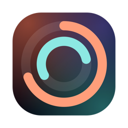

<p align="center">
  
</p>

<h1 align="center">AgentDeck</h1>

<p align="center">
  macOS 菜单栏应用：统一监控 <b>Claude Code</b>、<b>Codex</b> 与 <b>Qoder</b> 的额度和会话。
</p>

<p align="center">
  
  
  
  
</p>

<p align="center">
  <a href="https://agentdeck.yilin.dev">官网</a> ·
  <b>简体中文</b> · <a href="README.en.md">English</a>
</p>

<p align="center">
  
</p>
<p align="center"><sub>Claude、Codex 与 Qoder 概览（三语轮播，默认跟随系统语言）</sub></p>
<p align="center">
  
</p>
<p align="center"><sub>Agent 管理：分别控制面板、状态栏与主题色</sub></p>

AgentDeck 将 Claude Code、Codex 与 Qoder 的额度监控、会话管理和用量统计集成在一个菜单栏面板中。后端为纯标准库 Python daemon，macOS 客户端为 SwiftPM 工程中的原生 AppKit + SwiftUI 应用，仍保持零第三方运行时依赖、无 Electron / 打包器、无运行时下载。

## 设计原则

- **零第三方依赖** — 标准库 Python + SwiftPM 原生 AppKit / SwiftUI；不引入 Node、Electron 或任何打包器
- **本地优先** — 数据全程本机处理，零遥测；自动后台联网仅查询 Claude 额度与版本清单；Qoder 与 Qoder CN 是独立 Agent，国际版优先读取已登录 Qoder App 的本机 IPC 并回退 `qodercli`，CN 版只使用匹配的 `qoderclicn`；只有用户确认更新后才从固定 GitHub Release 地址下载 DMG
- **原生体验** — 连续曲率圆角、玻璃材质、桌面小组件，对齐系统组件的视觉标准
- **多语言** — 简体中文 / English / 日本語三层（面板 / 通知 / 菜单）统一，默认跟随系统

## 功能

**额度监控**
- 实时聚合 Claude 官方额度（5 小时 / 7 天窗口）、Codex rate limits 与 Qoder UsageInfo
- 多账号并行：自动发现 Claude / Codex / Qoder / Qoder CN 的独立配置目录；概览将“不同 Agent × 多个账号”拍平成同级全宽卡片，默认 6 秒自动轮播，可暂停并支持鼠标、触控板与键盘切换
- 状态栏用一个固定宽度槽位逐项滚动“Agent/账号图标＋对应额度”，默认 6 秒；对同时参与两处展示的 Agent/账号，与概览卡同步自动轮播、手动切换及暂停状态；可关闭后固定当前项，数字与变色各自可选 5h / 周 / 最吃紧窗口
- Claude / Qoder 额度查询间隔可调（默认 10 分钟，可至 6 小时）；Codex 由完成事件实时更新，并由 CLI 自带 app-server 周期校准
- 窗口重置进度条；额度临界与回满的系统通知（阈值可配置）

**会话管理**
- 识别 Claude / Codex / Qoder 活跃会话，覆盖终端内 CLI 会话与 Codex 桌面端会话
- “正在运行”按 transcript / rollout 最近活跃时间倒序排列；缺少观测时间时回退进程启动时间
- 点击活跃会话聚焦其所在终端：沿进程链自动识别宿主 `.app`，兼容任意终端，无需维护终端清单；iTerm2 / Terminal 精确至标签页；Codex 桌面端经 `codex://` 深链直达线程，Qoder App 会话直接回到 App
- 会话完成弹窗提醒，点击跳转回会话；事件去重，仅提醒一次
- 历史会话一键恢复：iTerm2 / Terminal / Ghostty / kitty / WezTerm / Alacritty 直接注入命令启动；Warp / VS Code / Cursor / Windsurf / Hyper / Tabby / Rio / Wave 走「打开应用 + 复制命令」
- 原工程目录移动后可选择新位置并记住映射；取消选择时复制不含旧路径的安全恢复命令，右键会话可重新选择或忘记映射
- 会话列表支持完整历史元数据搜索、按端筛选、分页加载、置顶与对话预览；SQLite 增量索引让查询不再逐次扫描 transcript

**用量统计**
- Claude / Codex / Qoder 近 7 / 30 天 token 用量；Claude / Codex 提供成本估算（口径见下文）
- 今日摘要、三 Agent 24 小时曲线、模型/Agent 分布、项目维度排行
- 支持导出 CSV

**界面与系统**
- 单一“Agent 管理”入口：纵向管理 Claude / Codex / Qoder 的面板显示、状态栏轮播参与项与主题色，新增 Agent 不再横向挤占设置页
- 字体大小 80–160% 整体缩放（面板与小组件同步）；暗化强度、精简模式等外观配置
- 活跃会话期间保持系统唤醒，防止长任务因休眠断流（默认开，可关）
- 兼容企业代理环境：App 访问本机 daemon 的流量绕过系统级 PAC 代理，避免回环被改道导致面板空白
- 版本更新发现：自动检查（仅查询版本号，可关闭）与设置内手动检查；发现新版后可在面板内下载、校验、安装并自动清理安装包，无需跳转网页
- 桌面小组件：常驻桌面层的玻璃信息卡，支持拖动、缩放与位置记忆

## 安装

推荐下载经过 Developer ID 签名与 Apple 公证的最新版本：

<p align="center"><a href="https://github.com/Spacebody/AgentDeck/releases/latest"><b>下载最新 AgentDeck DMG</b></a></p>

也可以从源码构建：

```bash
git clone https://github.com/Spacebody/AgentDeck.git && cd AgentDeck
./build.sh install
```

编译、安装至 `/Applications` 并启动，首次启动注册登录项实现自启。

**环境要求**：macOS 13+（Apple Silicon + Intel 通用二进制）；至少安装一个需要监控的 Agent：[Claude Code](https://claude.com/claude-code)、[Codex](https://openai.com/codex)、Qoder App、[Qoder CLI](https://docs.qoder.com/en/cli/quick-start) 或 [Qoder CN CLI](https://docs.qoder.cn/cli/quickstart)。仅从源码构建时需要 Xcode Command Line Tools（可经 `xcode-select --install` 安装）。

其余构建目标：

```bash
./build.sh           # 仅构建 dist/AgentDeck.app
./build.sh dmg       # 产出可分发 DMG
./build.sh uninstall # 卸载（默认保留数据目录）
```

首次使用「跳转会话」时，系统将请求**自动化（Apple Events）**权限用于聚焦终端窗口。

## 会话完成提醒集成

完成提醒依赖各 Agent 的事件回调。当前版本在 daemon 启动时会**幂等自动接入**，并只合并 / 移除带 AgentDeck 标记的配置：

- Claude Code：向 `~/.claude/settings.json` 的 `hooks.Stop` 合并一个指向 `~/Library/Application Support/AgentDeck/claude-stop-hook.sh` 的 Stop hook。
- Qoder：向已发现配置目录的 `settings.json` 合并 Qoder Stop hook，并通过 `qoder-stop-hook.sh` 标记事件来源。
- Codex：默认由 `~/Library/Application Support/AgentDeck/codex-notify.sh` 占用根 `notify` 并顺序转发原命令；若 Computer Use 等外部工具已持有根槽并通过 `--previous-notify` 链入 AgentDeck，则保留外部 owner，AgentDeck 不再反向转发，避免形成通知环。
- 集成状态记录在 `~/Library/Application Support/AgentDeck/integration.json`；`./build.sh uninstall` 会调用 daemon 的 `--remove-integration` 仅还原 AgentDeck 自己安装的条目。

仓库内仍保留手动调试用脚本 `scripts/codex-notify.sh`，但正常安装使用 App Support 中自动生成的 wrapper。

手动转发 Claude Stop 事件的最小命令形态如下：

```json
{
  "hooks": [{
    "type": "command",
    "command": "curl -sf -m 3 -X POST http://127.0.0.1:7777/api/event -H 'Content-Type: application/json' --data-binary @- >/dev/null 2>&1 || true",
    "timeout": 5,
    "async": true
  }]
}
```

## 架构

```
Package.swift        SwiftPM 包定义：AgentDeck 可执行目标、AgentDeckKit 库、PreviewGen 预览工具
Sources/AgentDeck/   AppKit 壳：菜单栏、NSPanel、桌面小组件、灵动岛、daemon 守护
Sources/AgentDeckKit/SwiftUI UI、API 客户端、数据模型、三语 i18n、预览渲染
Sources/PreviewGen/  无头渲染 UI 预览图，用于开发检查
agentdeckd.py        后端 daemon：采集 / 解析 / SQLite 会话索引 / HTTP API / hook 集成（纯标准库）
static/index.html    旧 Web UI / 浏览器 fallback；daemon 仍在 / 和 /index.html 提供
site/                官网与更新清单（Cloudflare Pages，零依赖静态页）
build.sh             构建 / 安装 / DMG / 卸载
scripts/             图标与 DMG 背景生成、Codex notify 包装、CSRF 回归测试
```

应用壳启动时拉起 daemon（监听 `127.0.0.1:7777`）；面板与小组件由 `NSHostingView` 承载 SwiftUI 根视图，经 HTTP API 取数。`static/index.html` 不再是主 App UI。

## 数据来源与隐私

所有数据**仅在本机处理**，无遥测、无上报：

| 数据 | 来源 | 说明 |
|------|------|------|
| Claude 额度 | 钥匙串中 Claude Code 的 OAuth 凭据 → `api.anthropic.com/api/oauth/usage` | 以用户本人凭据查询本人额度；多账号时按配置目录各自精确取对应凭据 |
| 版本检查 | `agentdeck.yilin.dev/version.json`（静态清单，6 小时缓存） | 仅比对版本号，不携带凭据或本机信息；可在设置中关闭 |
| Claude 用量 / 会话 | 解析已发现的各 Claude 配置目录下 `projects/**/*.jsonl` | token 统计、成本估算；会话标题、路径等头部元数据增量写入本地 SQLite 索引 |
| Codex 额度 | Codex CLI `app-server` 的 `account/rateLimits/read`，完成事件时辅以对应 rollout 的最新快照 | 不读取或转发登录 token；app-server 不可用时自动降级到有界本地解析 |
| Codex 用量 / 会话 | 解析本地 `~/.codex/sessions` rollout 文件 | token 统计；搜索和分页只读元数据索引，不逐次扫描原始会话 |
| Qoder 额度 | 已登录 Qoder App 的用户私有 Unix Socket；不可用时回退 `qodercli` UsageInfo | IPC 仅允许只读 `credit/usage`，CLI 仅请求 `get_usage_info`；不保存用户 ID、邮箱、头像或升级链接 |
| Qoder CN 额度 | 独立读取 `QODERCN_CONFIG_DIR` / `~/.qoder-cn`，并调用 `qoderclicn` UsageInfo | 与 Qoder 使用不同 Agent ID、设置开关、缓存和卡片；不读取国际版 App IPC，不透传初始化消息或 stderr |
| Qoder 用量 / 会话 | 配置目录下的 `projects/**/*.jsonl`；Qoder App 运行时补充其只读会话列表 | App 响应在适配器入口丢弃消息正文和身份字段；索引只保存 ID、标题、路径、分支和时间 |
| 完成事件 | AgentDeck 自动安装的 Claude / Qoder Stop hook 与 Codex notify wrapper 回调 | 完成提醒与事件流 |

运行时产物：数据目录 `~/Library/Application Support/AgentDeck/`，日志 `~/Library/Logs/AgentDeck.log`。其中 `claude_usage_cache.json`、`codex_usage_cache.json`、`qoder_usage_cache.json` 与 `session_index.sqlite3` 均为可重建缓存；用量缓存只保存按小时聚合值与文件指纹，会话索引只保存标题、项目、路径、分支、时间与文件指纹，均不保存完整对话正文。`pins.json` 是置顶状态真源，`path_mappings.json` 保存用户确认的工程迁移路径；删除数据库不会丢失这两类用户状态，只会触发后台重建索引。

## 安全设计

- daemon 仅绑定回环地址 `127.0.0.1`，不对局域网暴露
- 全部 `/api/*` GET 及 POST 接口校验本机 Host；POST 额外要求 Content-Type 精确匹配及 Origin 结构化同源校验，封锁 DNS rebinding / 浏览器 CSRF；附回归测试 `scripts/test-csrf.sh`
- 「按请求参数读取文件」的路径统一收口至对应 Agent 已发现的配置目录内（realpath 校验）
- 账号诊断接口 `/api/diag` 输出全程脱敏（token 仅留末 4 位）
- 自动更新仅接受固定 GitHub Release 路径，安装前核对 bundle ID、清单版本、完整代码签名、Team ID 与 Gatekeeper assessment；复制或复验失败会原子恢复旧 App
- 健康检查带身份校验，避免端口被其他进程占用时误判
- Qoder App IPC 只连接标准 `SharedClientCache` 下、当前用户所有且非组/全局可写的 Unix Socket；同时核对 Apple 证书链、官方 bundle 与服务二进制签名、服务 PID、连接后的 peer PID 与 socket inode，方法固定白名单并限制单次/全扫描响应大小、条数和端到端超时

## 统计口径

- **Claude**：主会话与 subagent 转写均纳入统计；usage 记录按 `(message.id, requestId)` 去重；cache 写入按 ephemeral 5m / 1h 两档分别计价；单价表按模型版本前缀匹配
- **Codex**：主会话与 subagent rollout 均纳入统计；`thread_spawn` 开头复制的父历史不重复计算，只统计子线程启动后的 `total_token_usage` 正增量，cached input 不重复计入 input；稳定会话缺少上游 token 遥测时会在面板标记统计不完整，不凭空估算
- **Qoder**：读取 transcript 中 assistant message 的 usage，按 `(message.id, requestId)` 去重并聚合 input、output 与 cache token；因没有稳定的公开模型计价接口，只统计 token，不计入 API 等值金额
- **项目归属**：项目 Top 会应用用户确认的工程迁移路径，同一工程移动前后的会话合并展示
- 金额为 Claude / Codex 静态模型单价表换算的 API 等值估算，不代表订阅实际账单；未知 Codex 模型按当前默认档估算，Qoder 不计入金额
- 面板内各 ⓘ 入口提供对应视图的逐项口径说明

## 致谢

- 菜单栏品牌字形取自 Claude / Codex 官方应用内置的菜单栏模板图，版权归 Anthropic / OpenAI 所有，仅作来源标识
- 会话跳转的终端聚焦思路最初借鉴 MioIsland（Ghostty 按 cwd 精确聚焦），现已演进为沿进程链自动识别任意终端宿主
- 用量统计以 [ccusage](https://github.com/ryoppippi/ccusage) 为独立基准交叉校准

## 更新日志

见 [CHANGELOG.md](CHANGELOG.md)。

## 许可证

[MIT](LICENSE)
