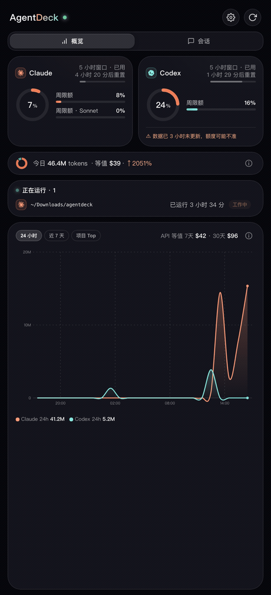
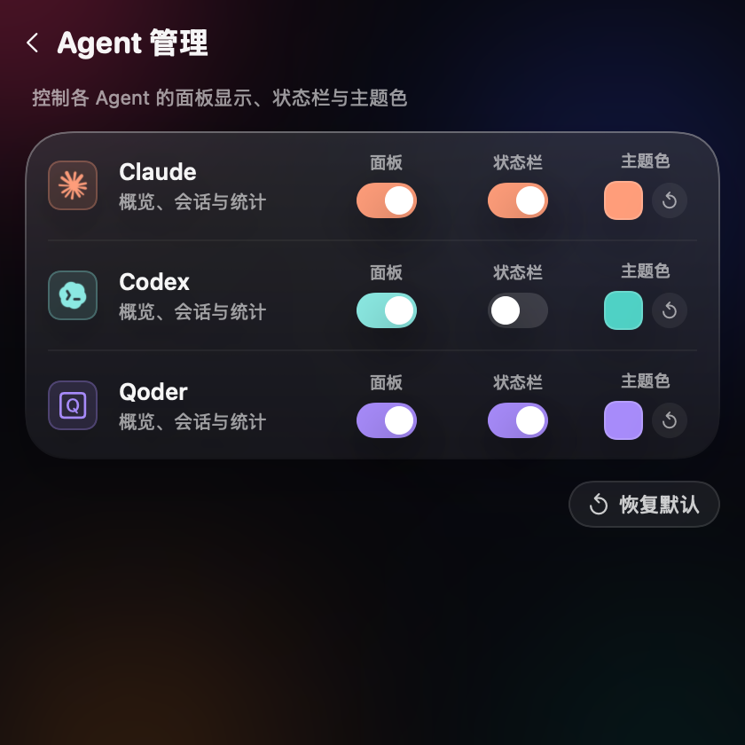

<h1 align="center">AgentDeck</h1>

<p align="center">
  在菜单栏盯住 <b>Claude Code</b> 与 <b>Codex</b> 的额度、会话与用量。<br>
  原生液态玻璃质感 · 零第三方依赖 · 数据纯本地。
</p>

<p align="center">
  
  
  
  
</p>

<p align="center"><b>简体中文</b> · <a href="README.en.md">English</a></p>

<p align="center">
  
  &nbsp;
  
</p>
<p align="center"><sub>概览面板（简体中文 / English / 日本語，默认跟随系统）· 设置</sub></p>

AgentDeck 把 Claude Code 与 Codex 的**额度、会话、用量**收进一个菜单栏小窗：窗口快满了它先告警，会话跑在哪个终端一键跳回，今天烧了多少 token 一眼看清。整个项目零第三方依赖——纯标准库 Python daemon + 单文件 Swift 应用壳 + 单文件 HTML 界面，无包管理器、无构建链、无运行时下载。

## 亮点

- **双端统一** — Claude Code 与 Codex 的额度 / 会话 / 用量，一个面板尽览，无需在多个工具间来回切换
- **零依赖 · 原生编译** — 没有 Node、没有 Electron、没有打包器；`swiftc` 直接编一个真正的原生 App，安装即用
- **隐私纯本地** — 全程在本机处理，唯一一条出站请求是用你自己的凭据查你自己的额度，零遥测、零上报
- **对标系统的质感** — 连续曲率圆角、玻璃材质、桌面小组件，做到系统原生小组件的观感标准
- **开箱多语言** — 简体中文 / English / 日本語，默认跟随系统，设置内即时切换

## 功能特性

**额度监控**
- Claude 官方额度（5 小时 / 7 天窗口）与 Codex rate limits 实时聚合
- 菜单栏常显用量百分比，支持单个 / 多个 / 隐藏的展示配置
- 窗口重置时间进度条；额度临界 / 回满的系统通知告警（阈值可配置）

**会话管理**
- 识别双端活跃会话，包括终端内运行的 CLI 会话与 Codex 桌面端会话
- 点击活跃会话直接聚焦其所在终端——**自动识别宿主终端，兼容任意终端**（沿进程链定位 `.app`，无需维护清单；iTerm2 / Terminal 精确到标签页），Codex 桌面端会话经 `codex://` 深链直达对应线程
- 会话完成弹窗提醒（灵动岛风格），点击跳转回会话；事件去重，仅提醒一次
- 历史会话一键在终端中恢复——iTerm2 / Terminal / Ghostty / kitty / WezTerm / Alacritty 自动直启，Warp / VS Code / Cursor / Windsurf / Hyper / Tabby / Rio / Wave 走「打开 App + 复制命令，粘贴回车」

**用量分析**
- 近 7 / 30 天 token 用量与成本估算，统计口径经独立工具交叉校准（详见下文）
- 今日摘要、24 小时环比曲线、模型分布、项目维度 Top 榜
- 数据可导出 CSV

**桌面小组件**
- 常驻桌面层的玻璃信息卡，支持拖动、缩放与位置记忆

**界面与系统**
- 多语言界面：简体中文 / English / 日本語，默认跟随系统语言，设置内即时切换
- 活跃会话期间保持系统唤醒，避免长任务因休眠 / 断网中断（可开关，默认开）

## 快速开始

```bash
git clone https://github.com/Spacebody/AgentDeck.git && cd AgentDeck
./build.sh install
```

一条命令完成编译、安装到 `/Applications` 并启动；首次启动自动注册登录项实现开机自启。装好后点菜单栏图标即可打开面板。

**前置条件**：macOS 13+ · 已安装 [Claude Code](https://claude.com/claude-code) 或 [Codex](https://openai.com/codex)（任一即可）· Xcode Command Line Tools（提供 `swiftc`，`xcode-select --install` 即可）。

其余构建目标：

```bash
./build.sh           # 仅构建 dist/AgentDeck.app
./build.sh dmg       # 产出可分发 DMG（含拖装窗口布局）
./build.sh uninstall # 卸载应用（数据目录默认保留）
```

首次使用「跳转会话」功能时，系统会请求**自动化（Apple Events）**权限，用于聚焦目标终端窗口，请予以允许。

## 可选配置：会话完成提醒

完成提醒依赖 Claude / Codex 的事件回调。AgentDeck 不会自动修改你的配置文件，需手动接线（均为单行改动）：

**Claude Code** — 在 `~/.claude/settings.json` 的 `hooks.Stop` 中追加：

```json
{
  "hooks": [{
    "type": "command",
    "command": "curl -sf -m 3 -X POST http://127.0.0.1:7777/api/event -H 'Content-Type: application/json' --data-binary @- >/dev/null 2>&1 || true",
    "timeout": 5,
    "async": true
  }]
}
```

**Codex** — 在 `~/.codex/config.toml` 中将 notify 指向仓库内的包装脚本：

```toml
notify = ["/path/to/agentdeck/scripts/codex-notify.sh"]
```

若原 notify 已被其他工具占用，可在脚本末尾以 `exec` 链式转发原命令（脚本内有说明）。

## 架构

```
agentdeckd.py        后端 daemon：数据采集 / 解析 / 聚合 / HTTP API（纯标准库）
app/main.swift       应用壳：菜单栏、玻璃面板、桌面小组件、完成提醒弹窗
static/index.html    面板界面：单文件，无构建步骤
build.sh             构建 / 安装 / DMG 打包 / 卸载
scripts/             图标与 DMG 背景生成、Codex notify 包装、CSRF 回归测试
```

应用壳启动时拉起后端 daemon（监听 `127.0.0.1:7777`），面板与小组件均为 WKWebView 加载同一份本地页面，数据经 HTTP API 交互。

## 数据来源与隐私

所有数据**仅在本机处理**，不含任何遥测或数据上报：

| 数据 | 来源 | 说明 |
|------|------|------|
| Claude 额度 | 钥匙串中 Claude Code 的 OAuth 凭据 → `api.anthropic.com/api/oauth/usage` | 全应用唯一一条出站请求，使用用户本人凭据查询本人额度 |
| Claude 用量 / 会话 | 解析本地 `~/.claude/projects/**/*.jsonl` | token 统计、成本估算、会话列表 |
| Codex 额度 / 用量 / 会话 | 解析本地 `~/.codex/sessions` rollout 文件 | 同上 |
| 完成事件 | Claude Stop hook / Codex notify 回调（见可选配置） | 完成提醒与事件流 |

运行时产物：数据目录 `~/Library/Application Support/AgentDeck/`，日志 `~/Library/Logs/AgentDeck.log`。

## 安全设计

- daemon 仅绑定回环地址 `127.0.0.1`，不对局域网暴露
- 全部 POST 接口设有 CSRF 屏障：Content-Type 精确匹配 + Origin 结构化校验 + Host 白名单（防 DNS rebinding），随仓库附带回归测试 `scripts/test-csrf.sh`
- 涉及「按请求参数读取文件」的路径统一收口至 `~/.claude` 目录内（realpath 校验）
- 健康检查带身份校验，避免端口被其他进程占用时误判

## 成本估算口径

- **Claude**：usage 记录按 `(message.id, requestId)` 去重；cache 写入区分 ephemeral 5m / 1h 两档分别计价；单价表按模型版本前缀匹配
- **Codex**：采用 `total_token_usage.total_tokens`（cached 为 input 子集、reasoning 为 output 子集，避免重复累加）；订阅制下给出 API 等值参考价
- 整体口径与 [ccusage](https://github.com/ryoppippi/ccusage) 交叉校准，偏差约 ±4%（差额来自 cache 分档精度）
- 面板中各 ⓘ 入口提供对应视图的逐项口径说明

## 致谢

- 菜单栏品牌字形取自 Claude / Codex 官方应用内置的菜单栏模板图，版权归 Anthropic / OpenAI 所有，仅作来源标识用途
- Ghostty 按工作目录精确聚焦的实现思路参考了 MioIsland
- 用量统计以 [ccusage](https://github.com/ryoppippi/ccusage) 为独立基准交叉校准

## 更新日志

见 [CHANGELOG.md](CHANGELOG.md)。

## 许可证

[MIT](LICENSE)
